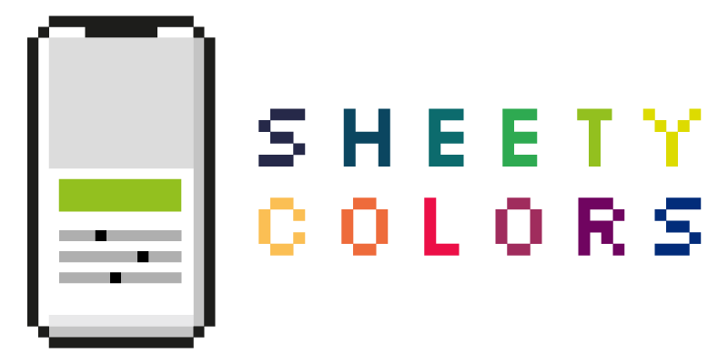

[](https://github.com/Carthage/Carthage)


[](https://app.bitrise.io/app/e955e72e7da4b8c0)
[](https://twitter.com/chr_wendt)

<p align="center">
  
</p>

**SheetyColors** is an action sheet styled color picker for iOS:

- **Based on UIAlertController:** The SheetyColors API is based on UIKit's `UIAlertController`. Simply add buttons to it as you would for any other Action Sheet by defining `UIAlertAction` instances. Therefore, it nicely integrates with the look & feel of all other native system dialogs.
- **iOS 13 ready:** SheetyColors has been tested on devices running iOS 13 Beta. The library is also optimized to work well with the new Dark Mode.
- **Fully configurable:** You can choose between a variety of configurations such as a color model (RGB, HSB, or Grayscale), alpha component support, haptic feedback, text/message label, and many more.
- **Intuitive UI:** Each slider comes with a gradient that gives you an idea of how changing individual slider values affects the resulting color.

|RGB, HSB, and Grayscale|Fully configurable|Dark mode support|
| :-: | :-: | :-: |
|![Color picker supporting RGB, HSB, and Grayscale][minimum_config]|![Fully configurable][fully_configurable]|![Dark mode support][dark_mode]|

[minimum_config]: ./Documentation/demo_minimum_configuration.png "Color picker supporting RGB, HSB, and Grayscale"
[fully_configurable]: ./Documentation/demo_customizable.png "Fully configurable"
[dark_mode]: ./Documentation/demo_dark_mode.png "Dark mode support"

## Example
To get a quick overview, you can checkout the example app on [Appetize.io](https://appetize.io/embed/gggkv26ep4xn6819f181ffqxpw?device=iphonex&scale=75&autoplay=false&orientation=portrait&deviceColor=black)

To run the example project from Xcode, clone the repo, and run `pod install` from the Example directory first.

## Installation

There are currently four different ways to integrate **SheetyColors** into your apps.

### CocoaPods

```ruby
use_frameworks!

target 'MyApp' do
  pod 'SheetyColors'
end
```

### Swift Package Manager

```ruby
dependencies: [
    .package(url: "https://github.com/chrs1885/SheetyColors.git", from: "1.0.2")
]
```

### Carthage

```ruby
github "chrs1885/SheetyColors"
```

### Manually

Simply drop `SheetyColors.xcodeproj` into your project. Also make sure to add
`SheetyColors.framework` to your app’s embedded frameworks found in the General tab of your main project.

## Usage

Creating a SheetyColors picker is as easy as creating a normal `.actionSheet` styled `UIAlertController`. First, you need to import the library:

```swift
import SheetyColors
```

Next, simply create a `SheetyColorsController` instance and add some actions to it:

```swift

// Create a SheetyColors view with your configuration
let config = SheetyColorsConfig(alphaEnabled: true, initialColor: color, hapticFeedbackEnabled: true, title: "Create a color", type: .rgb)
let sheetyColors = SheetyColorsController(withConfig: config)

// Add a button to accept the selected color
let selectAction = UIAlertAction(title: "Save Color", style: .default, handler: { _ in
	self.color = sheetyColors.color
}
sheetyColors.addAction(selectAction)

// Add a cancel button
let cancelAction = UIAlertAction(title: "Cancel", style: .cancel, handler: nil)
sheetyColors.addAction(cancelAction)

// Now, present it to the user
present(sheetyColors, animated: true, completion: nil)
        
```

Please check the [documentation](./Documentation/Reference/README.md) for further information on the API.

## Contributions

We'd love to see you contributing to this project by proposing or adding features, reporting bugs, or spreading the word. Please have a quick look at our [contribution guidelines](./.github/CONTRIBUTING.md).

## License

SheetyColors is available under the MIT license. See the [LICENSE](LICENSE) file for more info.
